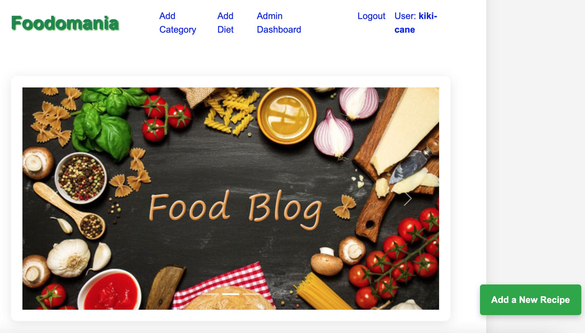
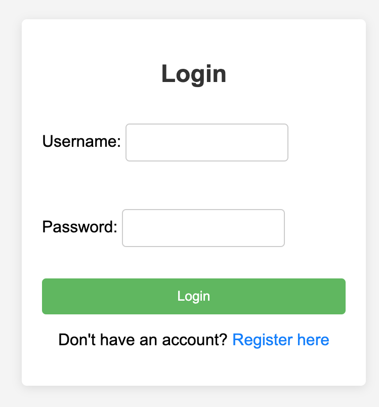
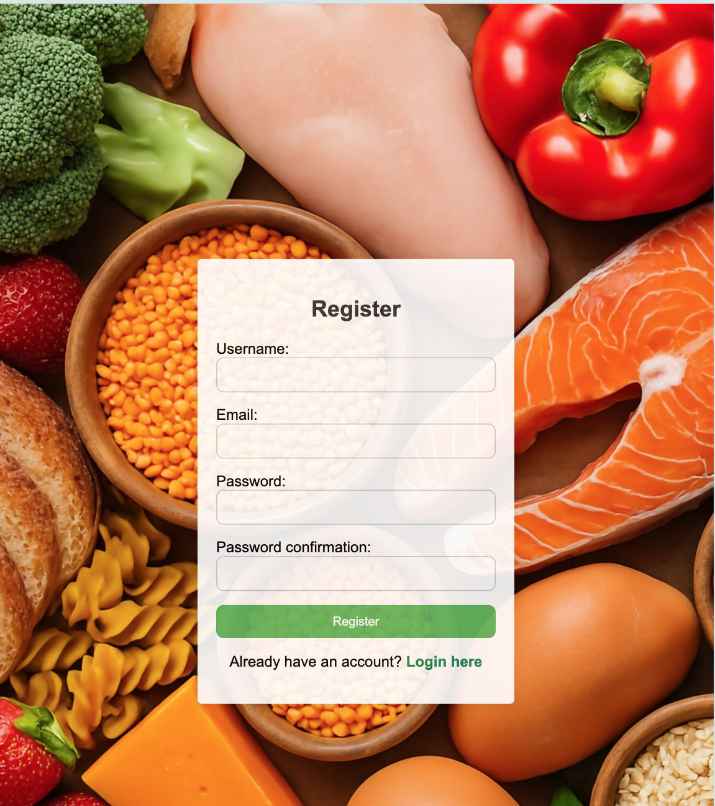
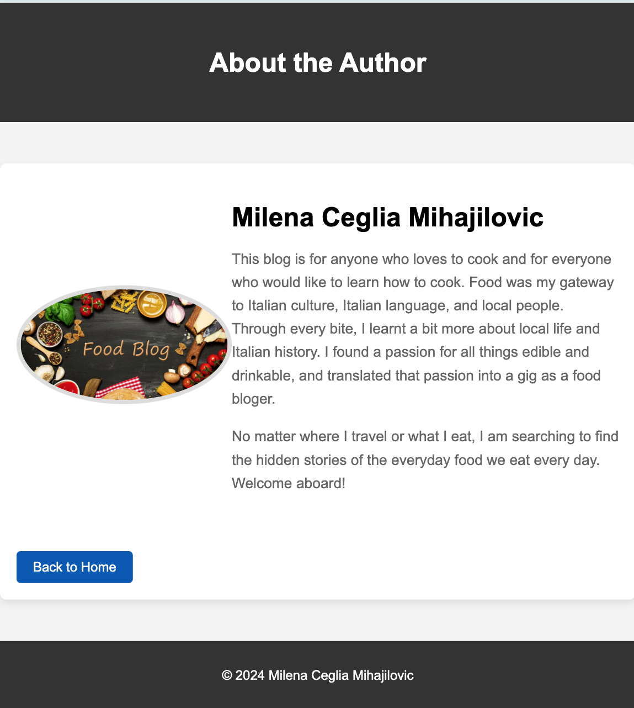
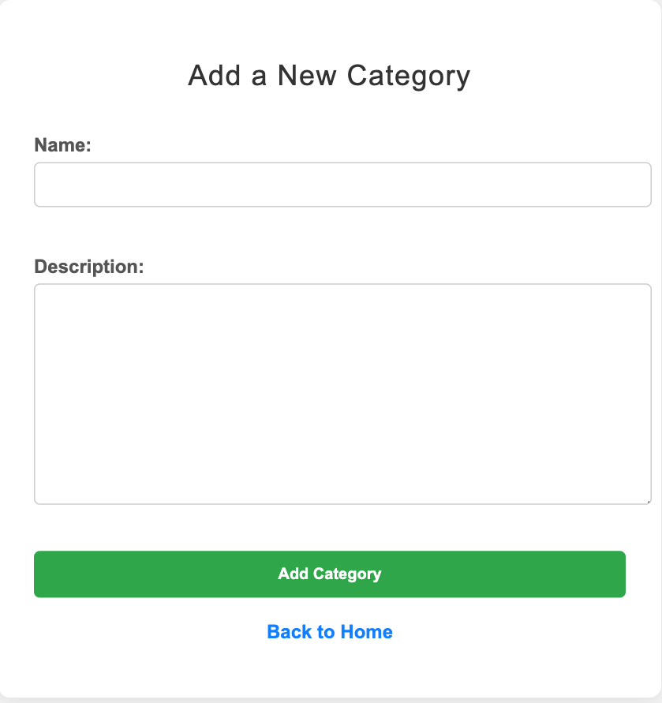
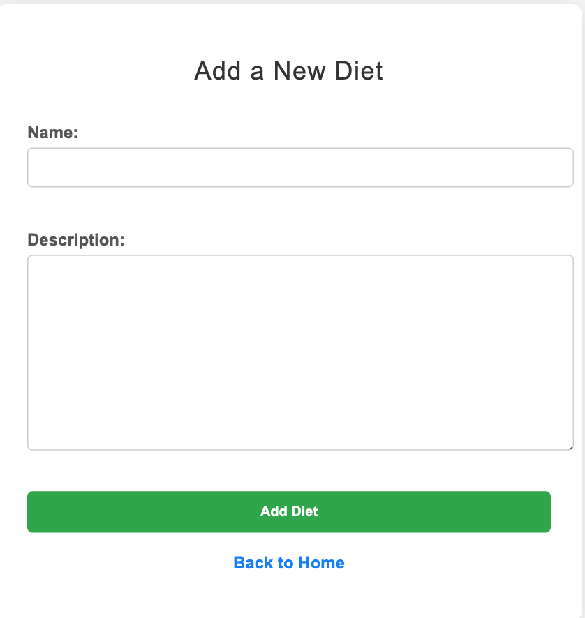
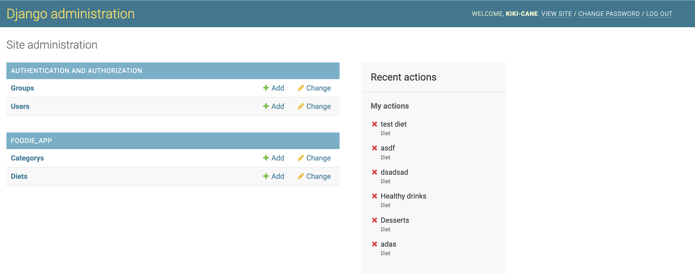

# Foodomania

### Features

Web application has the following pages:

* Home page
* Login page
* Register page
* About page
* Add Category page
* Add Diet page
* Admin Dashboard page
* Add a New Recipe Page

Access to pages according to the user role:

| Page Name |  User  | Admin |
|:-----|:--------:|------:|
| Home page   | Y | Y |
| Login page |  Y  |   Y |
| Register page | Y |  Y |
| About page | Y | Y |
| Add Category page | N | Y |
| Add Diet page | N | Y |
| Admin Dashborad page | N | Y |
| Add a New Recipe Page | Y | Y |

### Home Page 

The home page includes a search bar that allows users to type in various diets and recipe categories.

### Login Page

Login page has a field inputs with username and password. Plus there is a register button as well.

### Register Page

A Register page includes an input fields with an username, email, password, password confirmation and it has also an login button. 

### About Page

The About page shares the author’s story and how her love for food blogging was inspired by Italian culture.

### Add Category page 

The category page, accessible only to the admin, is used for adding categories for recipes.

### Add Diet page

The admin-only diet page allows the administrator to create diet types for recipe classification.

### Admin Dashboard page 

The Admin Dashboard page provides administrative users with tools to manage content, users, and platform activity.

