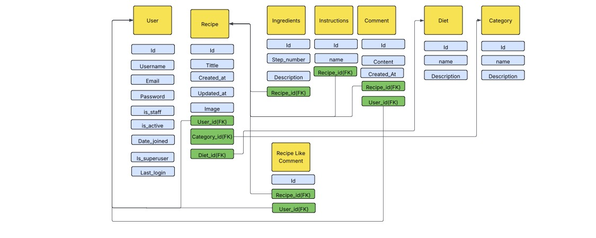

# Foodomania

##### Live Version: [Foodomania](https://foodomania-p4-37eb7adaefc4.herokuapp.com/)
##### Repository: [GitHub Repo](https://github.com/EmaMiha/Foodomania)

# About
Foodomania is a web application presenting a collection of cooking instructions and food preparation ideas for users of all skill levels. The application allows users to do discovering and searching recipes, viewing detailed recipe information, leaving the comments and likes, creating and deleting recipes.
The application was built using Python (Django), HTML, CSS, and JavaScript, with data being stored in a PostgreSQL database.

# User Experience Design

### Strategy

The goal of this app is to create a user-friendly, engaging platform that helps users discover, manage, and share recipes. Food blogs continue to evolve by integrating social, technological, and culinary trends, making them essential tools for modern kitchens. Whether you're a beginner or a seasoned chef, Foodomania app offers a convenient and engaging way to explore the world of food. 

### User Stories

#### First Time User

#### Logged-in User

# Features

Please refer to the [FEATURES.md](https://github.com/EmaMiha/Foodomania/blob/main/FEATURES.md) file for all features-related documentation.

# Flowcharts

The following flowcharts were created to help to understand the application and its functionality.

The flowcharts were created using Lucidchart.

# Testing
Please refer to the [TESTING.md]() file for all test-related documentation.

