# Testing

### Manual Testing

|  | User Actions| Expected results   | Y/N | 
|:-----|:--------:|------:| :-------: | 
| Registration |  |  |  | 
| 1.  |  Click on Register button   |  Redirection Registration page  | Y |
| 2.  | Enter Username  |  The field accepts any name, provided it is not already in use   |  Y |
| 3.  |  Enter Password   |  Field will accept the password with minimum 8 characters | Y |
| 4.  |  Enter password confirmation | Field will only accept the same password from the previous field | Y |
| 5. |  Click on the Login link in the form  |  Redirection to Login page  | Y |
| Log In |  |  |  | 
| 1.  |  Click on Login button   |  Redirection Login page  | Y |
| 2.  |  Enter Username  | The field accepts only valid username  | Y |
| 3.  |  Enter Password   | The field accepts only valid password | Y |
| 4.  |  Click on the Registrate link in the form   |  Redirection Registration page  | 
Y |
| 5.  |  Click on Logout   | Successfully logged out  | Y |
| About|  |  |  | 
| 1.  |  Click on About   |  Redirection About page  | Y |
| 2.  |  Click on Back to Home   |  Redirection Home page  | Y |
| Add Category |  |  |  | 
| 1.  |  Click on Add Category  |  Redirection Add Category page  | Y |
| 2.  |  Enter Name and Description  | If the name and description fields are completed, clicking the "Add Category" button will create a new category only by admin side | Y |
| 3.  |  Click on Back to Home |  Redirection Home page  | Y |
| Add Diet |  |  |  | 
| 1.  |  Click on Add Diet  |  Redirection Add Diet page  | Y |
| 2.  |  Enter Name and Description  | If the name and description fields are completed, clicking the "Add Diet" button will create a new diet only by admin side | Y |
| 3.  |  Click on Back to Home |  Redirection Home page  | Y |
| Admin Dashboard |  |  |  | 
| 1.  |  Click on Admin Dashboard |  Redirection Admin Dashboard page  | Y |
| 2.  |  Click on Groups and Users  | These operations are used to create or remove users and groups | Y |
| 3.  |  Click on Categories and Diets  |  Categories and diets can be added or deleted through these actions.  | Y |
| Add a New Recipe |  |  |  |
| 1.  |  Click on Add a New Recipe |  Redirection Add a New Recipe page  | Y |
| 2.  | Enter Title, Ingredients, Instructions and choose Categories and Diet  | Recipe added successfully | Y |

# Validation

### HTML Validation
 
* No errors or warnings were found when passing through the official Nu Html Checker.

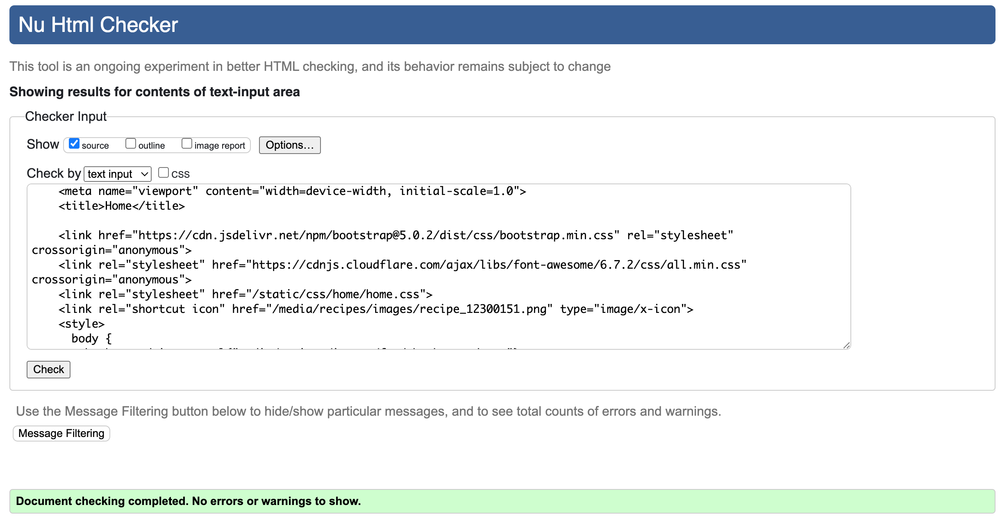

### CSS Validation

* No errors or warnings were found when passing through the official W3C validator.

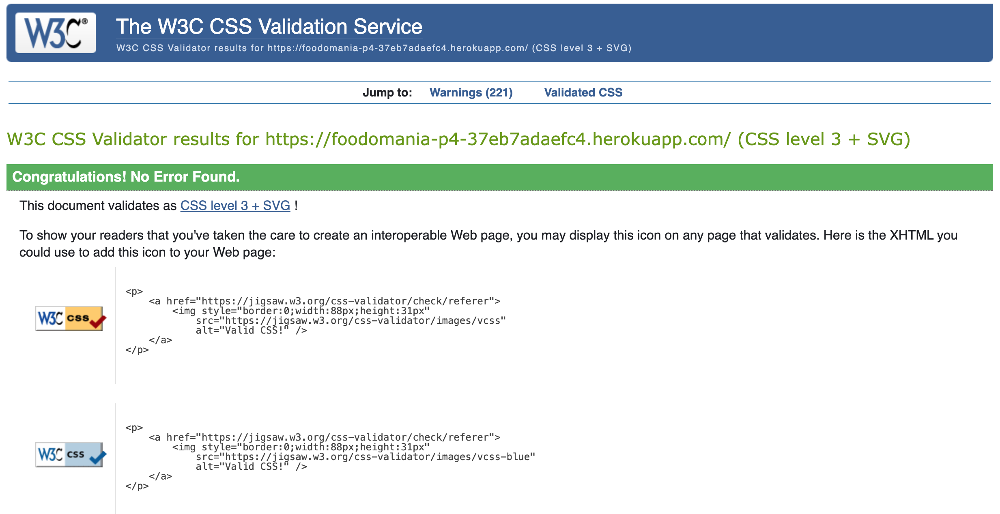

### JS Validation

* While running the JavaScript validator through the JSHint, warnings were detected, but no errors were found.

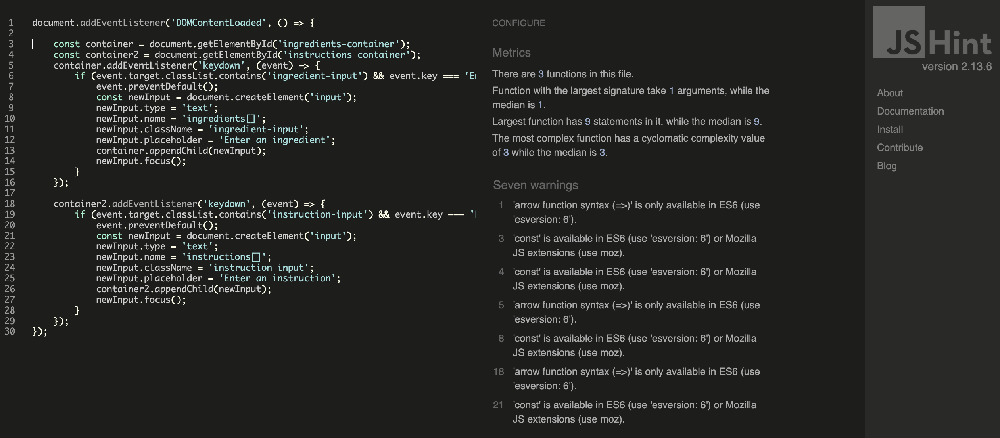

### Python Validation

The python code was tested using Coding Institutes Python Linter and no errors were detected.

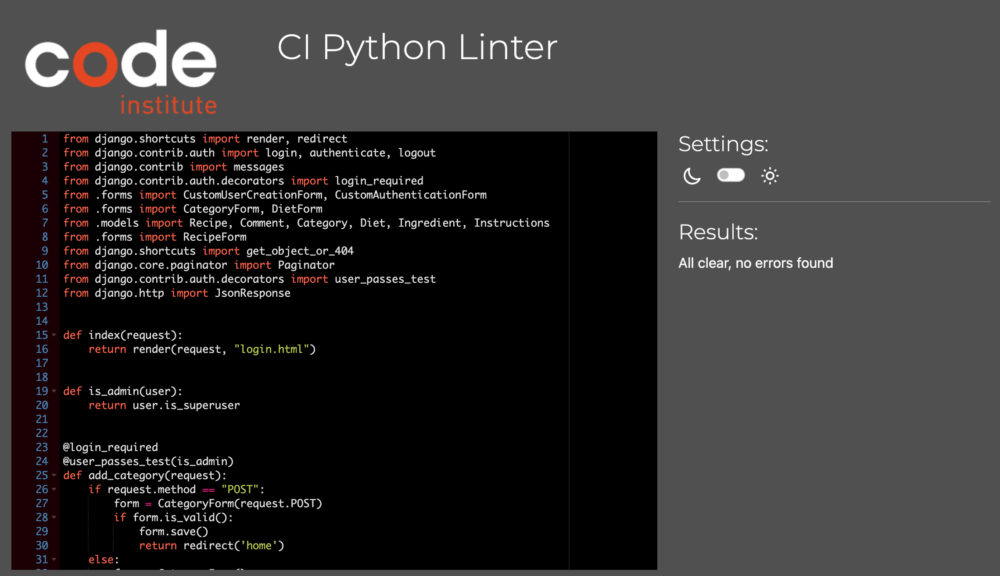

### Lighthouse Report

#### Home Page

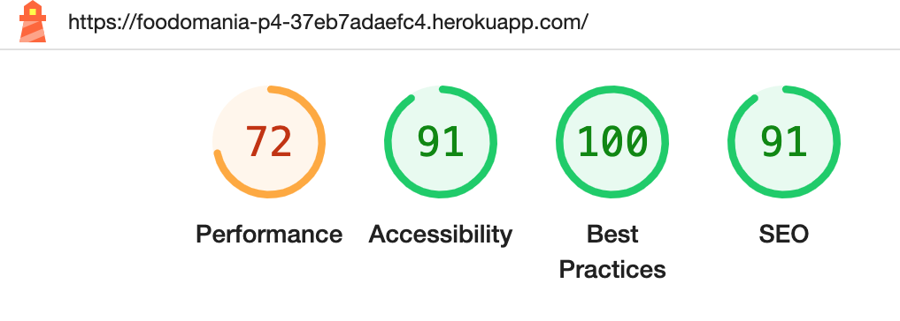

#### About Page

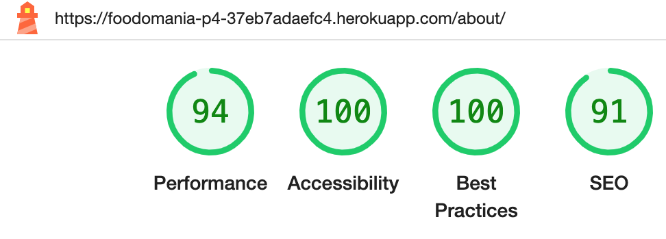

#### Login Page

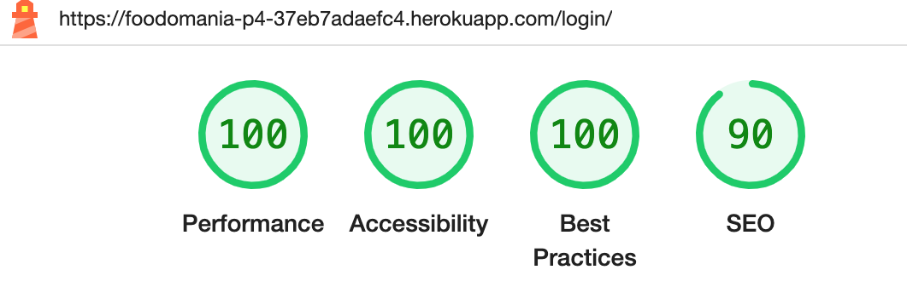

#### Register Page

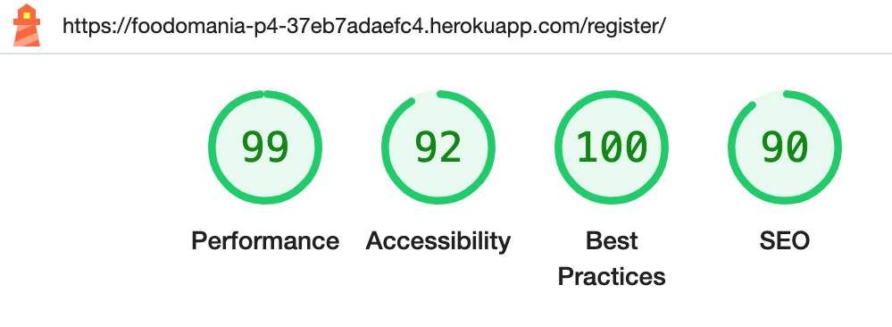

#### Add Category Page

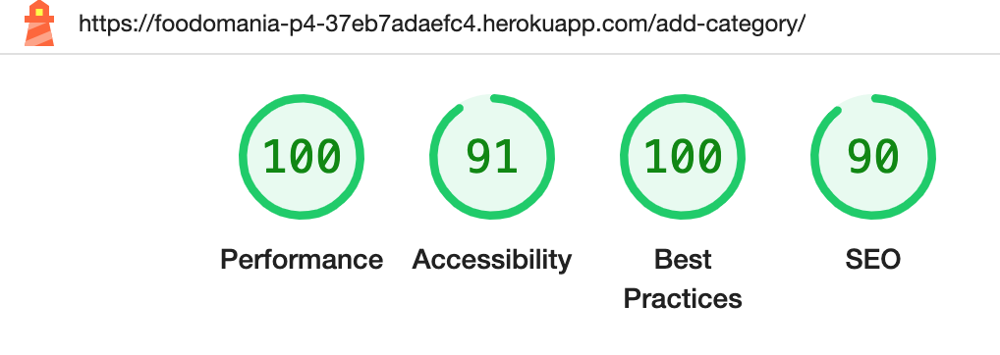

#### Add Diet Page

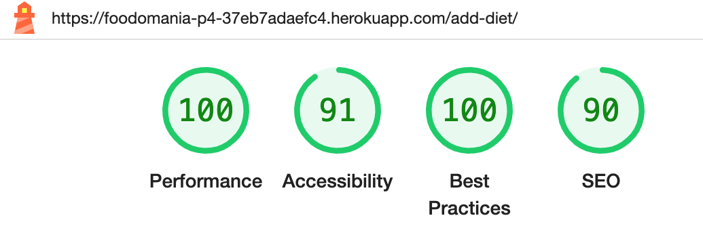

#### Add Recipe Page

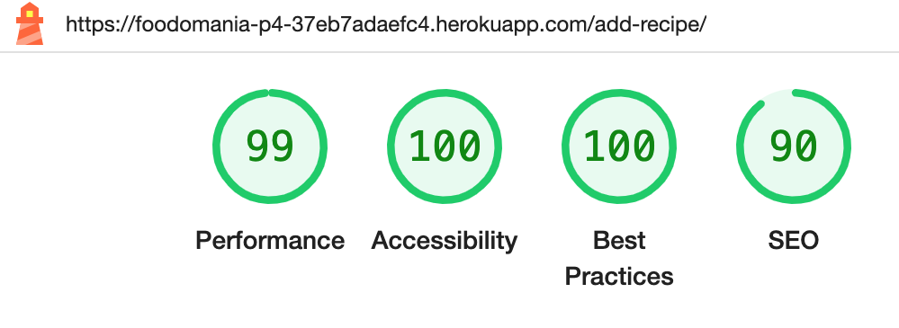

